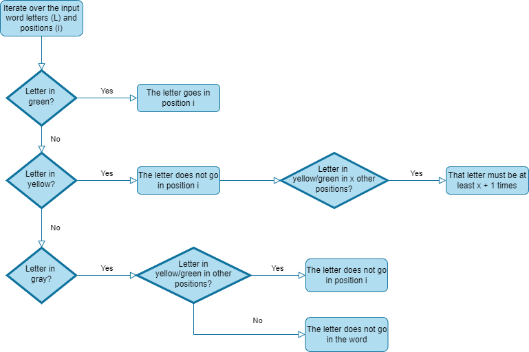

# Wordle Decipher

*This project was made to:*
1. Play the game as many times as you want.
2. Help the player decide which words to place in the game.
3. Help the player decide which initial word to use in the game.

## Game

---

**For those of you who want to play more than once per day.**

To initialize the program run the "game.py", and play as many times as you please.

The default language is english. If you wish to change it head to the "config.py" file and change 
the "LANGUAGE" parameter to 'spanish', 'english' or 'french'.

By default, the words have 5 characters. If you want to experiment beyond this boundaries
 head to the "config.py" file and change the "WORD_SIZE" parameter to any size you please.

### Game instructions
The objective is to guess the word in 6 or less tries.
Each guess must be a valid 5-letter word.

After each guess, a vector will show you how close your guess was to the secret word.

This vector (e.g: 10200) represent how correct was each letter of the word:
* 0: incorrect letter
* 1: correct letter incorrect place'
* 2: correct letter and place

For example if the underlying word is "carie" (unknown to the user), and they put the 
word "ceras" the game will show 21200.

After you either win or loose a prompt will pop up asking you to either play again
pressing "y" or to exit by pressing "n".

## Game Decipher

---

**For those of you who want to decipher the game in fewer tries.**

To initialize the program run the "decipher_game.py" file.
Each time you want to decipher a new word you can re-open this file.

This code works by discarding the words which are not possible by using the games outputs, and later
getting the most used word in the list of possible words.

### Decipher Game Instructions

First input the word that you placed in the game. 
Next put a combination of zeros ones and twos based on the game outputs:
0: incorrect letter
1: correct letter incorrect place'
2: correct letter and place

For example if the underlying word is "carie" (unknown to the user) and they put the 
word "ceras" the game will show green-yellow-green-gray-gray, which the user should translate to
21200 and input to the program.

This would look like this:
* Enter chosen word:  >? ceras
* Enter 0/1/2 string:  >? 21200

## Initial Word

---

**For those of you who want to get a better initial word for the real game.**

To do so you must run the "decipher_game.py" file. Each time you want to decipher a new word you can re-open this file.

### Instructions to Run

Run the "initial_word.py" file, it will return a list of 100 possible words. 
Note that not all of them are words accepted by the real game, since they
are obtained from different databases.

You must go through the words and search the first one which is accepted by the game.

The code for this idea was obtained from another user, the source is in the credits.

## Run CPU

---
**To test how good is the decipher game against itself**

In order to test how good the program is against itself the "run_cpu.py" file was created.
This shows statistics on how is the model expected to behave if tested in the real life game.

It shows the average attempts for the won games, the percentage of wins (games solved in less than  7 attempts)
and the count and percentage of times each number of attempts it took to win.

The following table shows the statistics for the code ran 1000 times in english:

Average attempts: 3.901.
Wins: 99.0%.

| Attempts | Count | % | 
| :----: | :----: | :----: | 
|2| 54 | 5.34|
|3|293 |29.00|
|4|409 |40.49|
|5|186 |18.41|
|6| 58 | 5.74|
|losses| 10 | 0.99|

# Credits

---

Code to run the initial word:
[Solving Wordle Puzzles with Basic Python by Mickey Petersen](https://www.inspiredpython.com/article/solving-wordle-puzzles-with-basic-python)

Spanish words obtained from:
[Corpus de Referencia del Español Actual by Real Academia Española](http://corpus.rae.es/lfrecuencias.html)

English words obtained from:
[English Word Frequency by Rachael Tatman](https://www.kaggle.com/rtatman/english-word-frequency/version/1)

French words obtained from:
[LEXIQUE By Boris New & Christophe Pallier](http://www.lexique.org/)